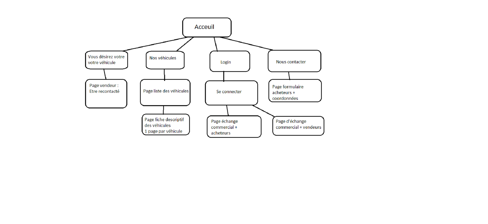

**Présentation de l’entreprise**

BYE BUY CAR est le seul concept d'agence automobile 2.0 qui aide les particuliers de la vente à l'achat de leur véhicule en utilisant des outils de visite virtuelle automobile et une garantie mécanique de 12 mois sur l'ensemble des véhicules.

Créée en 2014, l’enseigne a développé un concept d’agence automobile axé sur l’exploitation optimale des nouvelles technologies, et notamment des visites virtuelles. La pertinence du concept et la performance des outils développés par l’enseigne lui ont permis de réaliser une belle première année de développement en franchise. 

Notre client Mr COSTEAUX Morgan, président directeur général d’une franchise Bye Buy Car Lille créé en 2022. La société s’occupe de faire l’intermédiaire entre le vendeur et l’acheteur. Elle propose également des rachats cash de véhicules qu’elle vend par la suite.
Bye Buy Car Lille garanti la sécurité et la satisfaction pour le vendeur comme pour l’acheteur.

**Les objectifs du site**

*Les objectifs du site sont* :
1.	Création d’un site internet qui permettra à notre client d’exposer les véhicules disponible à l’achat.
2.	Un visuel pour le vendeur et pour l’acheteur des informations concernant la sécurité et les services proposés par Bye Buy Car.
3.	La possibilité pour le vendeur de télécharger les documents à remplir pour la mise en vente de son véhicule.
4.	La possibilité pour le vendeur de demander d’être contacté pour un commercial. Le commercial recevra alors un message.
5.	Afficher un plan de l’emplacement de l’agence sur la page d’accueil
6.	Créer une boite de dialogue entre le commercial et le vendeur ou le commercial et l’acheteur. L’un et l’autre recevront une alerte sur leur boîte mail indiquant qu’il y a un message. 
Dans cette boîte de dialogue le commercial pourra indiquer au vendeur, via un agenda, les dates où il y aura des visites pour son véhicule. Le commercial pourra alors noter s’il y a eu une offre ou pas.
Dans cette boîte de dialogue le commercial pourra afficher au vendeur et à l’acheteur les étapes de transaction.

**Le public ciblé**

*Le public ciblé peut se diviser en deux groupes* :
1.	Les personnes souhaitant vendre leur véhicule en toute sécurité sans avoir à s’occuper eux même des visites et de la transaction.
2.	Les personnes souhaitant acquérir un véhicule d’occasion en toute sécurité car l’agence garanti que le véhicule est en bon état.

**Le périmètre du projet**

•	Le site sera publié uniquement en langue française
•	Il s’agit d’un site vitrine pour l’agence Bye Buy Car Lille
•	Le site sera composé de pages statiques ainsi que de pages dynamiques

**La charte graphique**

Le site devra se conformer à la charte graphique de Bye Buy Car pour permettre une reconnaissance immédiate de l’entreprise. 
L’utilisateur arrivant sur le site Bye Buy Car Lille, comprendra qu’il s’agit d’une agence qui dispose d’une bonne notoriété.

**Le logotype**

Le logo peut se présenter sous différente forme. Néanmoins, le logo doit impérativement contenir le nom de la société et les icones définis par le siège. 

**La typographie**

Le client ne souhaitant pas de police spécifique, nous nous sommes entendus pour utiliser une police d’écriture standard : Arial.

**Les contenus en détail**

L’entête de chaque page devra contenir une photo en background en haut de page, les coordonnées de la société en haut de l’entête à gauche et à droite les logos vers les réseaux sociaux, le logo de la société sur la gauche en dessous des coordonnées, ainsi qu’un onglet menu déroulant à droite du logo. Sur la gauche de l'onglet déroulant, un message `Vous désirez vendre votre véhicule ?` clicable. Entre les deux un logo page d'accueil pour revenir sur la page d'acceuil de n'importe quel page. A droite du menu déroulant les contacts. A droite de ce dernier, un logo Login. 

Sur chaque fin de pages il devra y avoir un rappel des coordonnées ainsi que les conditions général.

**Arborescence du site web :**

 
**La page d'accueil**

La page d'accueil sera composé dans l'ordre : 
D'un carrousel
De messages concernant l'entreprise.
Des annonces de véhicules en vente
Des avis clients
Un plan d'accès aux bureaux de l'agence

**Pop-up Se connecter**

Dans cette pop-up, l'utilisateur pourra saisir son identifiant et son mot de passe. Un bouton CTA lui permettra de valider pour se connecter. 
Les utilisateurs ne pourront avoir un compte que si l'agence les inscrits elle-même. Si l'identifiant saisie est celui d'un vendeur il sera diriger sur la page d'échange commercial + vendeurs. Si l'identifiant saisie est celui d'un acheteur il sera diriger sur la page d'échange commercial + acheteurs.

**Menu déroulant : nos véhicules d'occasion**

Un message `Nos véhicules d'occasion`
Plusieurs choix pour affiner la recherche : 
• Par marque : 
    Renault
    Peugeot
    Citroën
    BMW
    Audi
• Par carburant : 
    Essence
    Diesel
    Hybride

Nos véhicules à boite automatique
Nos véhicules de moins de 50 000km
Nos véhicule de moins de 100 000km

• Par type : 
    SUV avec croquis 
    Berline avec croquis
    Monospace avec croquis
    Breaks avec croquis

Enfin un bouton CTA Tous nos véhicules qui envoi sur la page Les véhicules.

**Pages Les véhicules**

Sur la gauche de cette page devra être mit un long encadré recherche avancé. Par prix, par année, par marque, par type, par couleur, par carburant, par transmission et enfin par kilométrage. 
Au centre de la page la liste de tous les véhicules proposés par l'agence ou en cas de recherche avancé la liste des véhicules correspondant. 
La liste devra contenir une photo du véhicule, le nom, le prix et de breves informations comme l'année, le kilométrage, le carburant et la transmission. 
En haut à droite de la liste un menus déroulant `Triez par`. Dans ce menu : prix croissant ou décroissant, année croissante ou décroissante. 
En bas de page à la fin de la liste, un listing vertical et numéroté des pages.

**Page vendeur**

Après avoir cliqué sur le bouton CTA `Vous désirez vendre votre véhicule ?`, l'utilisateur arrivera sur cette page. 
Elle devra contenir les messages suivant : 
• Vous désirez être recontacté ? 
• Remplissez le formulaire 
• Notre équipe s'engage à vous rappeler dans les plus bref délais
Sur la gauche de la page se trouvera un formulaire que le vendeur pourra compléter en remplissant obligatoirement tous les champs. A la fin du formulaire un bouton CTA pour valider et envoyer le formulaire.
Sur la droite de la page à côté du formulaire sera listée, la liste des documents que le vendeur devra ramener pour finaliser son dossier en agence. 

**Page fiche véhicule**

Une page par véhicule.
Sur la partie gauche de cette page : le nom complet du véhicule, suivi d'une photo. Ensuite l'équipement ainsi que les options dont il est pourvu.
Sur la partis droite de la page : un descriptif. Un bouton CTA `Voir la Vue 360`. Ensuite à la suite :
Année du modèle
Kilométrage
Couleur exterieure
Boite de vitesse
Energie
Emissions de CO2

Toujours sur la droite un rappel des numéros de contact et de l'agence. En dessous du numéro un formualire Nous contacter à propos de ce véhicule 
Puis un formulaire Nom Adresse mail et Message. Un bouton CTA pour envoyer la requête. 

**Page pour les acheteurs**

En cliquant sur `Contact`, l'utilisateur arrivera sur cette page.
Un message : Vous chercher un véhicule ? Vous avez des questions ? N'hésitez plus et contacter notre agence Bye Buy Car Lille. 
Sur la gauche de page un formulaire Nom, Adresse mail et Message avec un bouton CTA pour envoyer la requête.
Sur la droite de la page, un rappel complet des coordonnées de l'agence avec les horaires d'ouverture
En bas de page avant le footer, un plan d'accès à l'agence. 

**Page d'échange acheteurs**

En haut de la page sur la gauche, le nom et prénom du commercial avec ces coordonnées. Ai milieu de la page et à droite des coordonnées, un titre `Espace vendeur`.
Sur la page de l'écran, deux encarts. Le premier sera nommé `Mes véhicules`. En cliquant dessus, apparaîtra en centre de la page, les informations concernant le ou les véhicules que le client souhaite acheter. Il y aura donc, pour chaque véhicule choisi, une photo de celui-ci suivi de la référence de l'annonce, l'immatriculation, le modèle, l'année, le kilométrage, les options.
En dessous, une animation montrant l'avancé de la transaction : 
    • Commande validé
    • Réception du virement
    • En cours de préparation
    • Livraison planifiée
    • Facture envoyée

Le deuxième encart sera nommé `Messagerie`.  En cliquant dessus, apparaîtra en centre de la page, une boîte de dialogue entre le commercial et le client. Si le commercial envoi un message dans cette boîte, le client recevra un mail dans sa boîte personnel lui indiquant un message reçu et inversement si c'est le client qui envoi un mail au commercial. 
Sur la droite de la boite de dialogue, on pourra trouver tous les documents échangés par le commercial et le client. Il devra également avoir un bouton CTA permettant de déposer un document. 

**Page d'échange vendeurs**

Cette page sera quasiment identique à la page d'échange acheteurs. La seule différence c'est qu'en dessous des informations du véhicules il devra y avoir un titre `Suivi de mandat` suivi d'une animation : 
    • En cours
    • Résilier (si la vente n'a pas pu aboutir) ou Virement reçu
    • Vendu

